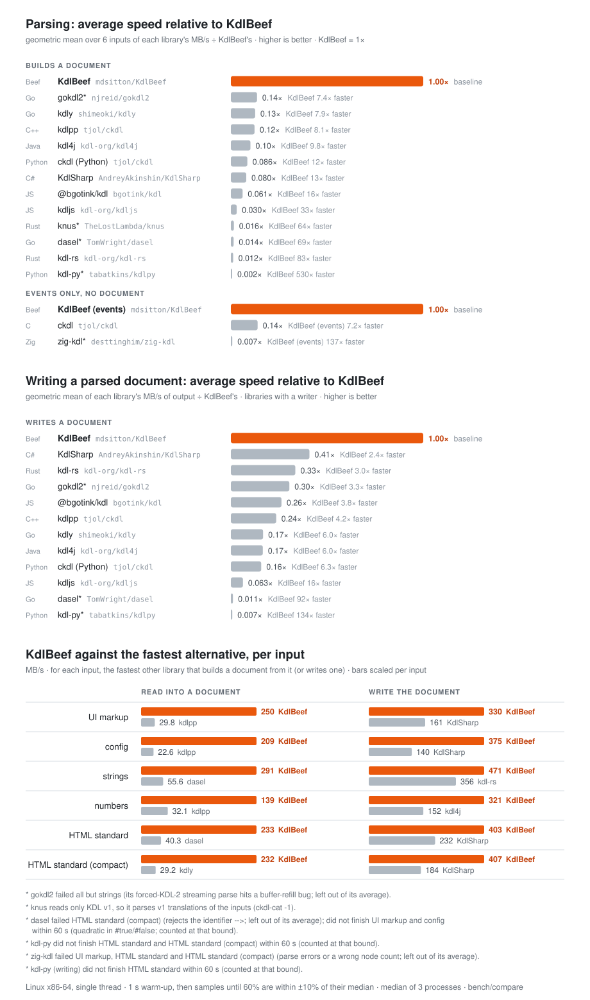
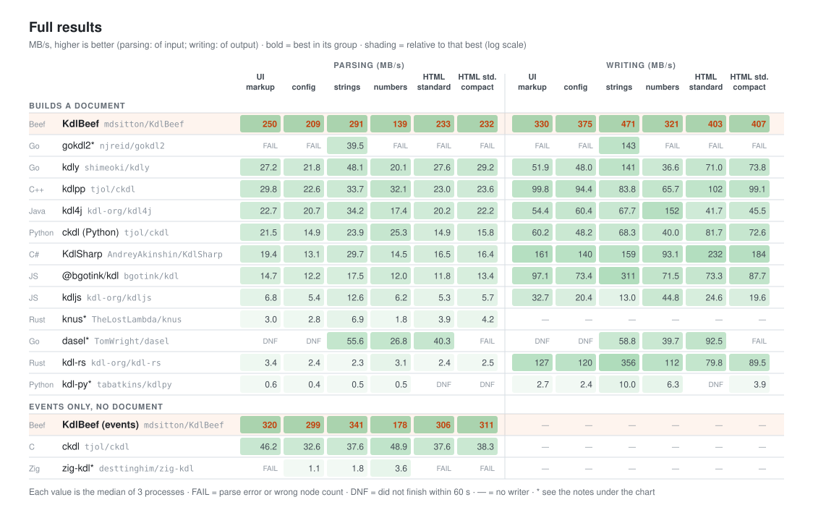
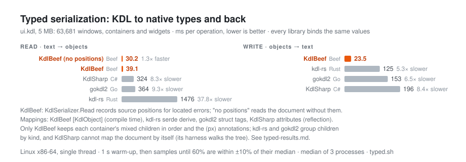

# KdlBeef

A [KDL 2.0](https://kdl.dev) parser and writer for the [Beef programming language](https://www.beeflang.org/),
built for UI markup: fast, spec-compliant, with located errors, format preservation and compile-time
typed mapping. The sibling of [TomlBeef](https://github.com/mdsitton/TomlBeef),
[XmlBeef](https://github.com/mdsitton/XmlBeef) and [JsonBeef](https://github.com/mdsitton/JsonBeef), built
on [FormatCore](https://github.com/mdsitton/FormatCore).

**Status:** reading, writing, editing, positions, limits, streams, collect-errors, style
preservation and compile-time typed mapping (`[KdlObject]`) are done and pass the whole official
test suite. Parsing runs at 140–300 MB/s into a document and 180–340 MB/s as events,
several times the fastest other KDL implementation (`bench/compare/results.md`). See
[docs/status.md](docs/status.md), [docs/architecture.md](docs/architecture.md) and
[docs/plan.md](docs/plan.md).

```beef
let doc = scope KdlDocument();
doc.ReadConfig.MetadataMode = .PreserveStyle;          // keep comments and formatting
if (doc.ReadFile("ui.kdl") case .Err(let error))
    Console.WriteLine(error.ToString(.. scope .()));   // ui.kdl:12:5: Expected ...
for (let node in doc.Nodes)
{
    if (node.Name == "button" && node.TryGetString("on-click", let handler))
        Console.WriteLine(handler);
    node.SetProperty("enabled", .Bool(true));
}
let text = doc.Write(.. scope .());                    // as it was, with the edits

// Lookups chain; a missing node or value gives the fallback
let columns = doc.Root.Find("window").Find("grid").GetInt64("columns", 1);
for (let button in doc.Root.Descendants.Named("button"))   // the whole tree; Children.Named for one level
    Console.WriteLine(button.GetString(0));

let reader = scope KdlReader(text);                     // or events, without a document
while (reader.Next() case .Ok(let event) && event != .EndOfDocument) {}
```

Typed, generated at compile time:

```beef
[KdlObject] class Button : Widget
{
    [KdlArgument(0)] public String Label ~ delete _;   // button "Save" on-click=save width=120
    public String OnClick ~ delete _;
    public int32 Width = 80;
    public Style Style ~ delete _;                     // a child node: style color=red
}

[KdlObject] class Panel : Widget
{
    [KdlChildren] public List<Widget> Items ~ DeleteContainerAndItems!(_);   // button …, panel …
    public Dictionary<String, String> Data ~ DeleteDictionaryAndKeysAndValues!(_);  // data { user-id "42" }
}

let panel = scope Panel();
Try!(panel.KdlRead(doc.Nodes.Find("panel")));           // or KdlSerializer.Read(text, obj) for a document
```

## Performance

<p align="center"></p>

<p align="center"></p>

Every library parses the same inputs (four generated, 2–5 MB, and the 16–21 MB HTML-standard
documents from the KDL repository's benchmark) from memory, single-threaded, on Linux x86-64, and writes the
parsed document back to text. Each harness warms up for 1 s, then samples until at least 60% of its
samples are within ±10% of their median; each value is the median of 3 separate processes. Every
harness must report the same node count as ckdl, or its cell is FAIL. Event parsers (ckdl's C core,
zig-kdl) build no document, so they are compared with KdlBeef's `KdlReader` pass rather than its
document. knus reads only KDL v1, so it parses v1 translations of the same inputs. dasel is timed
on its own KDL parser and writer, not on the conversion into its generic data model. Library
versions are pinned. To reproduce, from `bench/compare/`:

```bash
./fetch.sh && ./build.sh && ./gen-inputs.py   # and beefbuild -config=Release at the repository root
./run.sh > results.md && ./plot.py            # table of MB/s, then docs/benchmark*.svg
```

`results.md` has the table and notes on each harness.

### Typed serialization

Every library with a typed mapping reads the 5 MB UI markup into matching native types (windows,
four container kinds, eight widget kinds) and writes them back (`bench/compare/typed.sh`, results
and how faithfully each library maps the document in `bench/compare/typed-results.md`); each checks
the same values after reading and after re-reading its own output:

<p align="center"></p>

`[KdlObject]` generates the binding code at compile time and binds from a parsed document, so typed
nodes and hand-edited ones can share a document. It is also the only mapping here that keeps a
container's mixed children in order and the `(px)` annotations; kdl-rs and gokdl2 group children
by kind, and KdlSharp needs the harness to walk the tree.

## Layout

- `src/KdlBeef/` — the library (and `tests/`); `KdlTester/` — the command-line harness
- `docs/plan.md` — implementation plan and handoff
- `docs/spec-reference.md` — KDL 2.0 rules and edge cases
- `docs/implementation-survey.md` — how existing implementations work
- `tests/fetch-spec.sh` — fetches the official spec and test suite
- `bench/compare/` — benchmark of KDL implementations in C, C++, Rust, Go, Java, JavaScript, C#,
  Python and Zig (`results.md`)

## Building

```bash
beefbuild            # library + KdlTester
beefbuild -test      # tests (Debug); -config=TestRelease for Release settings
tests/fetch-spec.sh  # the official test suite, then:
./test-kdl-spec.sh   # the suite in four modes; ./test-roundtrip.sh, ./test-leaks.sh
```

## License

MIT (see `LICENSE`). The KDL specification and test suite are CC BY-SA 4.0 and are fetched, not
included.
